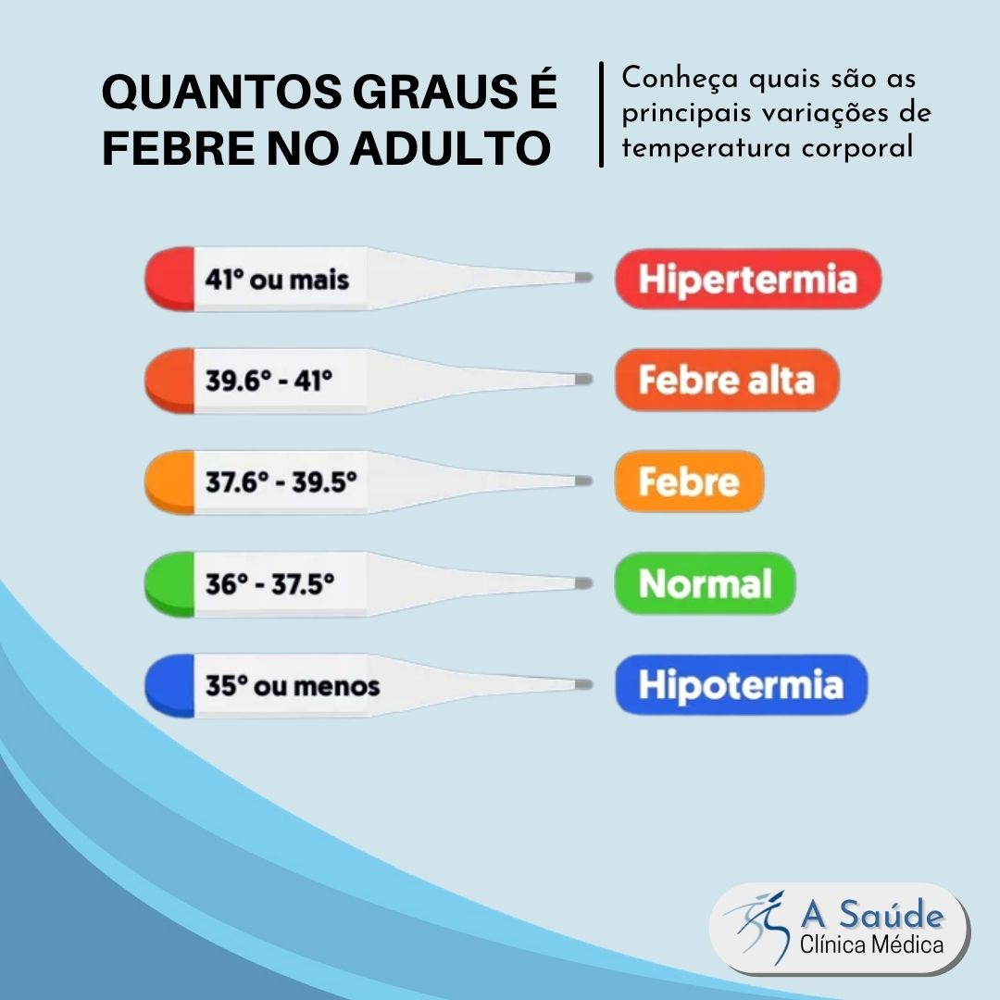

# Sprint 14 - Notes 

# Order of The Week

- [x]  1. Reunir com pessoal da FCS (Marcar e descrever temas pertinentes).

- [x]  2. Continuação do Relatório.

- [ ]  3. Adicionar o Wellness Value 

## 1. Reunião Estado: 13/06

## 3. WellNess Value

- Score (Conceitual): a intenção "final" seria também integrar com info clínica e de medicação do doente    para criar um score com mais valor clínico.
  - Percentagens:
    - Sintomas respiratórios, 10
    - usos de corticosteroides, 10
    - uso dos outros medicamentos: inalador 5; nebulizador 5; medicação oral 5; antibióticos 5
    - hospitalização/intubação/uso de oxigénio 30
    - CAT 15
    - Testes físicos 15

- Score (Pratico): 
  - Percentagens:
    - Variaveis_Sensor, 40
    - TestesFisicos, 30
    - Questionario, 30


### 3.1 Questionário - Pontuação

- Metodologia: Analisar o último questionário feito pelo doente e quantificá-lo

- Exemplo:  
```javascript                      
{
    "id": 28,
    "date": "2023-06-11 11:20:41.868",
    "idpatient": 9,
    "q1_pont": 2,
    "q2_pont": 0,
    "q3_pont": 3,
    "q4_pont": 0,
    "pontuation": 5,
    "impact_level": "Medium"
  },
  {
    "id": 29,
    "date": "2023-06-13 11:14:57.039",
    "idpatient": 9,
    "q1_pont": 2,
    "q2_pont": 3,
    "q3_pont": 3,
    "q4_pont": 4,
    "pontuation": 12,
    "impact_level": "Very High"
  }
```

- Tratamento de Dados:   
 $CAT1 - (100 * 5) / 16 =  31.25   [0-100]$  ||||||
 $CAT2 - (100 * 12) / 16 =  75 [0-100]$

- Input na fórmula: 
  $CAT1 - 68.75 (100 - 31.25)$ (Escala do pior 0 para o melhor 100) ||||||||||
  $CAT2 - 25 (100 - 75)$ (Escala do pior 0 para o melhor 100)

### 3.2 Testes Fisicos - Pontuação

#### 3.2.1 Testes Fisicos 6MWT - Pontuação
- Metodologia: Pegar no primeiro teste (Teste de Calibração) e avaliar consoante este.

- Fórmula : Cada passo dado a mais ou a menos tem peso de x5 || A cada aumento ou diminuição de pulsação  tem peso de x2

Exemplo:     

```javascript
Teste Fisico (1)     
{                    
    "id": 29,              
    "idpatient": 9,
    "initialpulsation": 86,
    "finalpulsation": 82,
    "date6test": "2023-06-04 21:34:48.05",
    "numbersteps": 7,
    "distance": "5.33",
    "testpercent": "20.20"
},

Teste Fisico (2) 
{
    "id": 19,
    "idpatient": 9,
    "initialpulsation": 96,
    "finalpulsation": 99,
    "date6test": "2023-06-04 21:14:07.312",
    "numbersteps": 10,
    "distance": "7.62",
    "testpercent": "20.20"
},

Teste Fisico (3) 
  {
    "id": 1,
    "idpatient": 9,
    "initialpulsation": 75,
    "finalpulsation": 81,
    "date6test": "2023-05-29 22:05:31.938",
    "numbersteps": 5,
    "distance": "3.81",
    "testpercent": "20.20"
  },
```

- O Teste Fisico 1 irá servir de calibração!
   - initialpulsation: 86,
   - finalpulsation: 82,
   - numbersteps: 7,
   - Média Pulsações: $(86 + 82) / 2 = 84$

- Tratamento de Dados - Teste Fisico 2: 
  - initialpulsation: 96, 
  - finalpulsation: 99, 
  - numbersteps: 10
  - Média Pulsações: $(96 + 99) / 2 = 97.5$

  - Número de Passos (1): 7 | Número de Passos (2): 10,
    - $Paf - Pai = 10 - 7 = +3$ 
    - $+3 * 5 = +15$ pontos

  - Média de Pulsações (1) = 84 | Média de Pulsações (2) = 97.5
    - $MPuli - MPulf = 84 - 97.5 = -13.5$ (Como quanto maior é -> pior é) 
    - $-13.5 * 2 = -27$ pontos

  - Percentagem do Teste Fisico 2
    - 50% (Percentagem do Teste de Calibração) + PontosPassos + PontosPulsacoes = 50 + (+15) + (-27) = **38 %**

- Tratamento de Dados - Teste Fisico 3: 
  - numbersteps: 5
  - Média Pulsações: $(81 + 75) / 2 = 78$


  - Número de Passos (1): 7 | Número de Passos (3): 5,
    - $Paf - Pai = 5 - 7 = -2$ 
    - $-2 * 5 = -10$ pontos

  - Média de Pulsações (1) = 84 | Média de Pulsações (3) = 78
    - $MPuli - MPulf = 84 - 78 = 6$ (Como quanto maior é -> pior é) 
    - $6 * 2 = 12$ pontos

  - Percentagem do Teste Fisico 3
    - 50% (Percentagem do Teste de Calibração) + PontosPassos + PontosPulsacoes = 50 + (-10) + (+12) = **52%** 

#### 3.2.1 Testes Fisicos 1MSTST - Pontuação
- Metodologia: Pegar no primeiro teste (Teste de Calibração) e avaliar consoante este.

- Fórmula : É a mesma do 6MWT mas em vez de passos, serve o 'count' (número de vezes que completou um ciclo levantar e sentar na cadeira)

- Procedimentos Iguais (Trocar 'steps' pelo 'count')


### 4. Variáveis do Sensor - Pontuação

#### Modo de Funcionamento do Sensor:

Frequência de Medição Normal: 
- 4 Medições / Dia

Anormalidades: Caso tenham sido detetados valores anormais, durante um intervalo considerável de tempo, em algum parâmetro:
- Repetição de medição de todos os parâmetros de 15 em 15 minutos na próxima hora.


#### Pontuação Prática:

1. Obtém-se um conjunto de registo de valores capturados do sensor para cada variavel nas ultimas 24 horas.
   1. Peso de cada hora nas variáveis:
      1. Intervalos de horas: Minimo 4 (4 Recolhas / Dia) 
      2. (24h - 18h -> 0.1; 18h - 12h -> 0.15; 12h - 6h - 0.20; 6h - 0h - 0.55)
   
2. Número de valores anormais por parâmetro. (Dar um peso maior numa escala crescente, do mais antigo ao mais recente).

3. Variável a Variável
   1. Temperatura 
      1. Avaliar tendo em conta estes parâmetros:
         
      2. Fórmula (0 a 100):
         1. 100% -> [36 - 37.5]
         2. 50% -> [36.0 - 35.5] || [37.5 - 37.6]
         3. 25% -> [35.5 - 35.0] || [37.6 - 39.5]
         4. 10% -> [35 - 34.8] || [39.5 - 41]
         5. 1% -> [34.8 - ] || [41 +]

   
Exemplo: Fórmula Pesos [24h - 18h -> 0.1%; 18h - 12h -> 0.15%; 12h - 6h - 0.20%; 6h - 0h - 0.55%]
  1. Temperatura (Dois exemplos Práticos)
     1. Valores Recolhidos nas últimas 24h: (37.9 [20h], 36.1 [14h], 36.2 [9h], 38.2[2h])
        1. $25 * 0.1 (37.9) + 100 * 0.15 (36.1) + 100 * 0.20 (36.2) + 25 * 0.55 (38.2)$  = **51.25%**
     2. Valores Recolhidos nas últimas 24h: (36.4[20h], 36.1[14h], 36.2[9h], 38.8 [5h], 37.9 [4:45h], 37.0[4:30h], 36.0[4:15h], 36.2[4:00h], 36.4[2:00h])
        1. Mais do que um valor num determinado intervalo -> Média: $38.8 + 37.9 + 37.0 + 36.0 + 36.2 + 36.4 / 6 = 37.05ºC ~~ 37.0ºC
        2. $100 * 0.1 (36.4) + 100 * 0.15 (36.1) + 100 * 0.2 (36.2) + 100 * 0.55 (37) =$ **100%**
